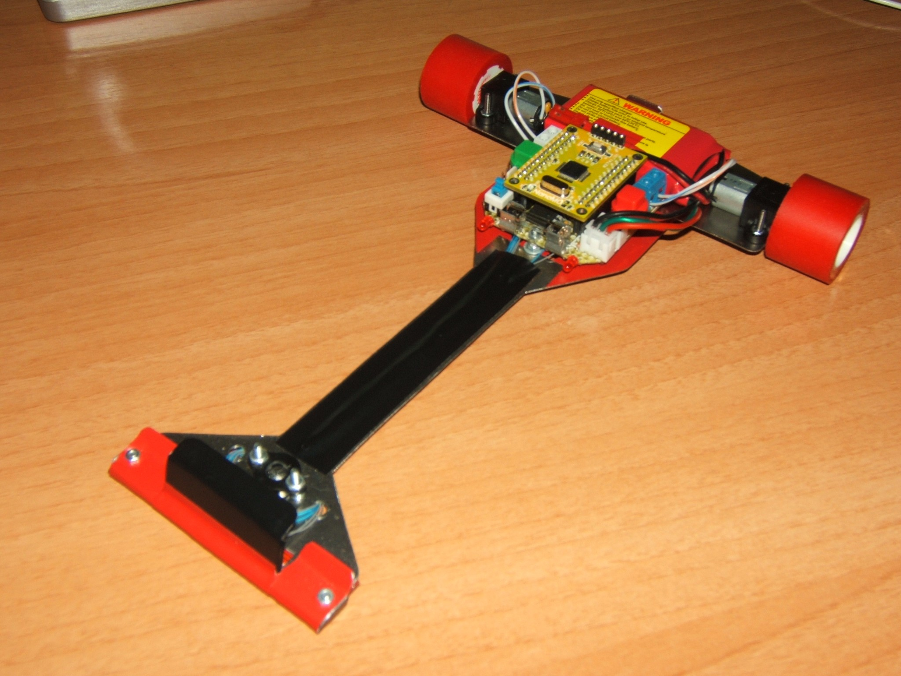

# Speed Demon
Speed Demon es mi primer velocista de competición. Ha participado en Alcabot y Cosmobot.

Es un robot bastante casero porque lo hice en 10 días con una plancha de acero que posteriormente cubrí de laca para que no se oxidara.
Para su primera competición tuve que cambiarle la placa del microcontrolador la tarde de antes porque la inicial daba muchos problemas. Le programé el algoritmo PID en una noche y a la mañana siguiente compitió incluso con aceleración en recta programada un rato antes.

Dio muy buenos resultados y quedó en una posición bastante digna, pero pronto fue sustituido por Pumatrón V2 en su versión velocista.
Los programas "actuales" de Speed Demon que he subido al repositorio quedaron en versión beta precisamente por eso.

## License

Todos estos productos están liberados mediante [Creative Commons Attribution-ShareAlike 4.0 International License](http://creativecommons.org/licenses/by-sa/4.0/).  
_All these products are released under [Creative Commons Attribution-ShareAlike 4.0 International License](http://creativecommons.org/licenses/by-sa/4.0/)._
